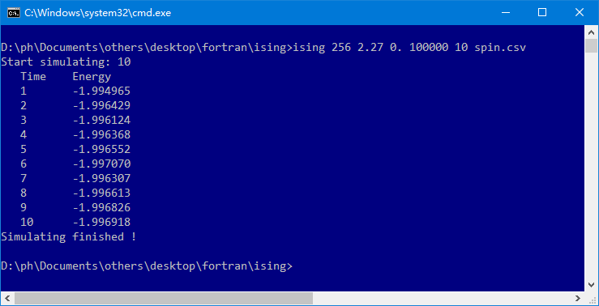
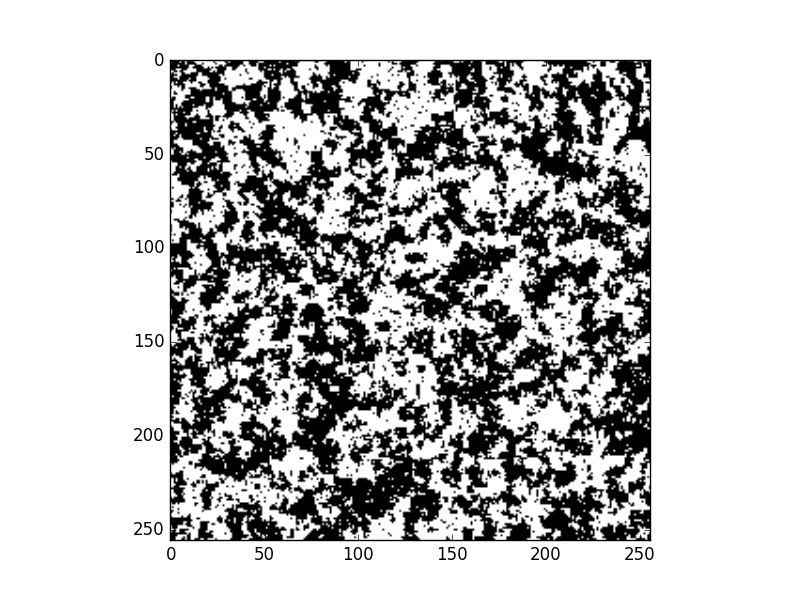
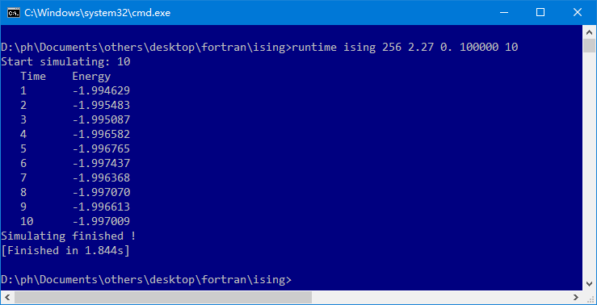

# Ising model 2d simulator for fortran
### File introduce
> `ising.f90`:      ising model simulation module file.
> `ising_main.f90`: ising simulation main program.
> `util.f90`:       util module with some useful function.
> `build.cmd`:      cmd file on windows for building `ising_main.f90`.
> `ising_plot.py`:  code to show spin site state based on python.
> `runtime.f90`:    a simple util to execute command and get running time.

### Usage and demo
1. compile `ising_main.90`
> `gfortran ising.f90 util.f90 ising_main.f90 -o ising`

2. start ising simulation
> usage: `ising [size] [temp] [magn] [steps] [times] [outfile]`
> example: `ising 256 2.27 0. 100000 10 spin.csv`
> 

3. plot simulation result of spin site.
> usage: `python3 [spin site file]`
> example:  `python3 spin.csv`
> 

4. usage of runtime
> usage: `runtime [command]`
> example: `runtime ising 256 2.27 0. 100000 10`
> 
> It takes about 1.844s for this simulation. We can use it to test our program.